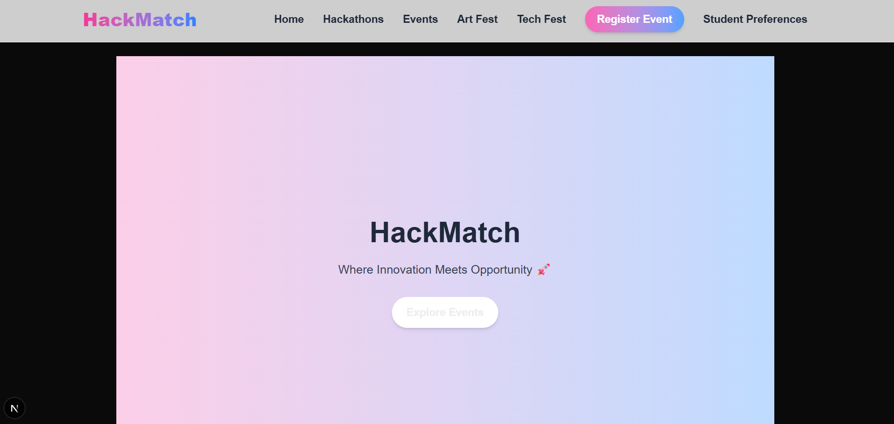
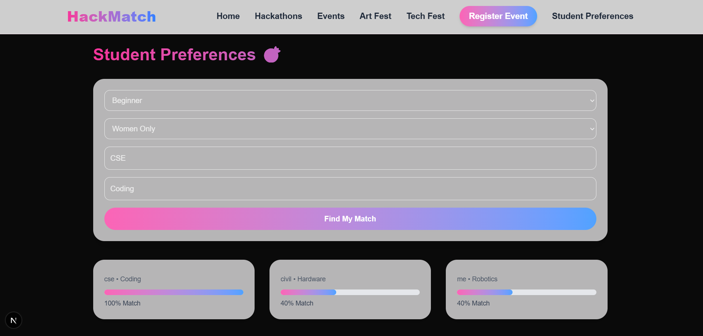

# HackMatch 🎯  
Find your perfect fest. Match your passion. Build your future.

---

## Basic Details

### Team Name:
HackMatch Innovators

### Team Members
- Member 1: Juvitta Santa Biju - Viswajyothi College of Engineering and Technology
- Member 2: Mariya Tess Arun - Viswajyothi College of Engineering and Technology

### Hosted Project Link
[https://your-deployment-link.vercel.app](https://hack-match-wine.vercel.app/)

---

## Project Description

HackMatch is a smart fest discovery platform that connects students with Hackathons, Tech Fests, and Art Fests based on their preferences.  
Students get personalized event matches, and coordinators can dynamically upload new events.

---

## The Problem Statement

Students often miss relevant hackathons and fests because event information is scattered across platforms.  
There is no centralized smart matching system that connects students with events based on their interests and skill levels.

---

## The Solution

HackMatch provides:
- A centralized fest discovery platform
- Coordinator event upload system
- Smart preference-based matching system
- Clean modern UI for easy browsing

Students enter preferences → System calculates match % → Best events are shown first.

---

# Technical Details

## Technologies/Components Used

### For Software:
- Languages used: TypeScript, JavaScript
- Frameworks used: Next.js 14 (App Router)
- Styling: Tailwind CSS
- Libraries used: React Hooks (useState, useEffect)
- Tools used: VS Code, Git, GitHub, Vercel

---

# Features

- 🎯 Smart student preference matching system
- 🏆 Dynamic hackathon & fest upload system
- 📊 Match percentage calculation
- 🎨 Modern gradient UI with responsive design
- 💾 Local storage event persistence
- 📱 Mobile responsive interface

---

# Implementation

## Installation

```bash
git clone https://github.com/your-username/hackmatch.git
cd hackmatch
npm install
```

## Run

```bash
npm run dev
```

Open in browser:
```
http://localhost:3000
```

---

# Project Documentation

## Screenshots


*Modern gradient landing page with navigation*


*Dynamic hackathon listing system*


*Smart matching system showing percentage results*

---

## System Architecture

```
User → UI (Next.js Frontend)
       ↓
Local Storage (Event Data)
       ↓
Matching Algorithm (Score Calculation)
       ↓
Sorted Results Display
```

HackMatch is a frontend-based dynamic system using browser storage to simulate real-time event handling.

---

## Application Workflow

1. Coordinator uploads event via Register Page
2. Event saved in localStorage
3. Student enters preferences
4. Matching algorithm calculates score
5. Events sorted by match %
6. Results displayed dynamically

---

# Additional Documentation

## API Documentation

Currently frontend-only (no backend API implemented).  
Data stored in browser localStorage.

Future backend scope:
- REST API for event CRUD
- Authentication system
- Admin dashboard

---

# Project Demo

## Video
[Add your YouTube / Drive demo link here]

Demo video shows:
- Event registration
- Smart matching system
- Hackathon & Fest listing
- UI responsiveness

---

## Live Demo
https://your-deployment-link.vercel.app

---

# AI Tools Used (Transparency)

**Tool Used:** ChatGPT  

**Purpose:**
- UI structure guidance
- Debugging assistance
- Matching logic refinement
- README documentation help

**Key Prompts Used:**
- "Create a dynamic event upload system in Next.js"
- "Build preference-based matching algorithm"
- "Improve Tailwind UI for fest platform"

**Estimated AI Contribution:** ~30%  
**Human Contribution:** Architecture design, UI customization, feature implementation.

---

# Team Contributions

- [Your Name]: Frontend development, Matching algorithm, UI design
- [Teammate Name]: Event system logic, Testing, Documentation

---

# License

This project is licensed under the MIT License.  
See the LICENSE file for details.

---

Made with ❤️ at TinkerHub
